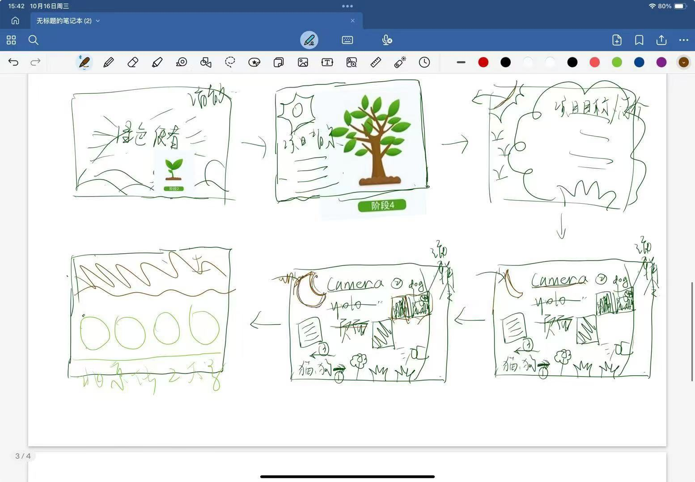
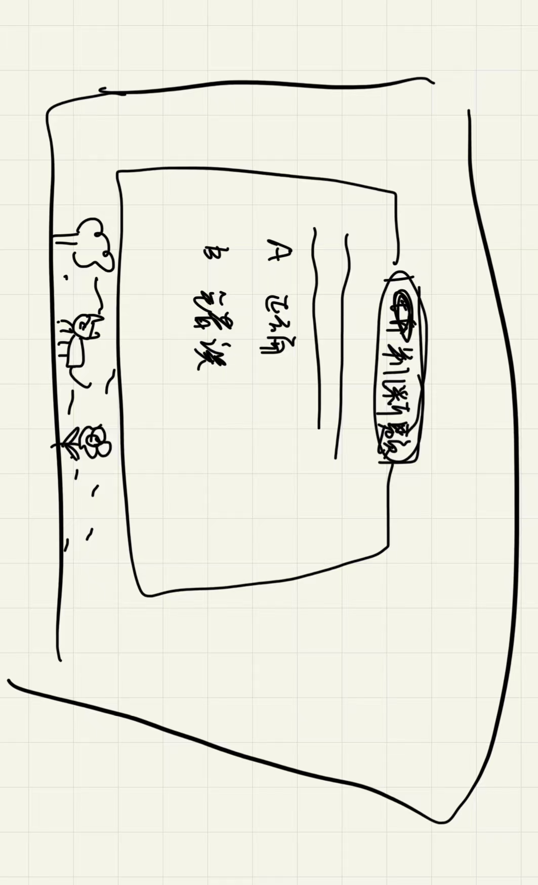
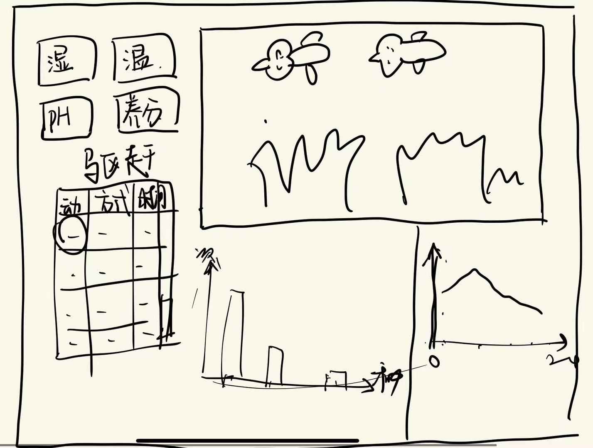

# 第二次小组会议

1. 交换大页面(feature_big)和问答页面(feature_QA)讨论意见

   

   

2. 讨论检测页面（feature_main）内容

	1. 左上角四个框直接显示生长状态（环境）数据
	1. 驱赶以表格方式展示驱赶记录：驱赶动物种类、驱赶方式、驱赶时间
	1. 下方2个图表展示小动物数据：不同种类小动物出现的次数（柱状图）、一天内不同时段小动物出现的次数（折线图）
	1. 右上为实时摄像头画面

预计11.17完成大页面和问答页面的代码